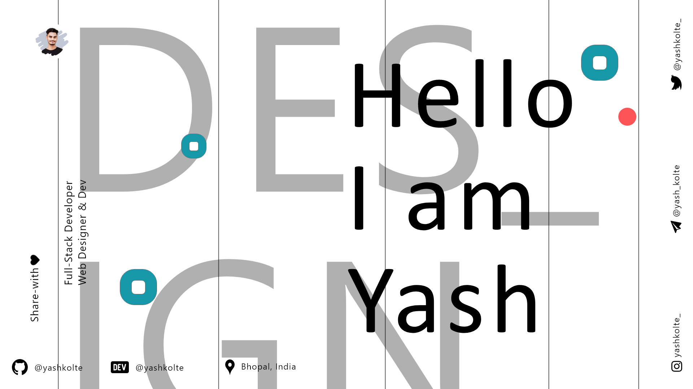

<picture>
  <source media="(prefers-color-scheme: dark)" srcset="./dark.png">
  
</picture>

&nbsp;
 

### Hey Fokers 

I am Yash Kolte a college student a passionate self-learner and a Front-End Developer, 
who is obsessed with Web Designing and always looking to find patterns of which are hidden in Code World.  

 

  

### 🛠 &nbsp;Skills 

<!--  -->

\
 

&nbsp;
&nbsp;
&nbsp;
&nbsp;

&nbsp;
&nbsp;

 

&nbsp;
 

&nbsp;

 

<h2> Connect with me  </h2>

   
 

 

<h2>📈 My Github Stats</h2>

  

   

   

 
 
<b>
Hey! Look at this snake eating up my contributions!
</b>

  

 

If you like my work , Do contribute in my repository And buy me a coffee if you want its really appreciated.

 

 

Thank you for watching my profile , <i>Giving star and follow is free and Unlimited.</i>

<h4 align="center">Share with Love 💚</h4> 

