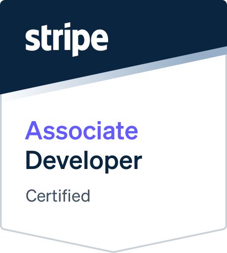

<picture>
  <source media="(prefers-color-scheme: dark)" srcset="./hero-dark.png">
  
</picture>

# 👋 Hey there! I'm Yash Kolte

### 🚀 Currently Working On

`Building scalable web applications` • `Exploring AI integrations` • `Freelance projects`

 

I’m Yash Kolte, a driven self-learner and a Full Stack Developer with a deep passion for crafting visually captivating and highly functional web experiences. My love for design and development fuels my curiosity to explore new technologies and uncover innovative patterns hidden in the world of code.

---

## 🌟 About Me

**Hello!** I'm Yash Kolte, a passionate Full Stack Developer and UI/UX Designer with expertise in crafting scalable web applications and intuitive user experiences. My journey in technology is driven by curiosity, continuous learning, and a commitment to writing clean, efficient code.

**🌟 What Sets Me Apart:**

- **🚀 Innovation-Driven**: Always exploring cutting-edge technologies and modern development practices
- **� Full Stack Expertise**: Proficient in both frontend and backend technologies
- **🎯 Problem Solver**: Focus on building solutions that solve real-world problems
- **🔄 Continuous Learning**: Recently certified in Stripe & GitHub, currently exploring Docker & AWS

 

---

## 🏆 Certifications & Achievements

### 🎓 Professional Certifications

 

#### 🐙 GitHub Foundations Certified

**GitHub Foundations** • _Earned June 2025_

✅ **Core Competencies:**

- Git and GitHub fundamentals and workflows
- Repository management & collaboration
- GitHub features and best practices
- Open source contribution methodologies

  

---

#### 💳 Stripe Certified Professional Developer

**Professional Developer** • _Earned June 4, 2025_

✅ **Core Competencies:**

- Payment integrations development using Stripe APIs
- Payment methods implementation and optimization
- Stripe Link integration for seamless checkout
- Low-code and no-code payment solutions

  

---

## 🚀 Product Hunt Launch

### 🏆 Featured Product Launch

 

#### 🎯 FreelancerPro – Your All-in-One Freelance Business Hub

**🌟 Product Description:** Track clients, projects, invoices, and payments – effortlessly. Whether you're juggling multiple clients or handling late invoices, FreelancerPro streamlines your freelance workflow so you can focus on delivering great work — not managing chaos.

**🔧 Key Features:**
- ✅ **Client Management** - Centralized dashboard for all client information
- ✅ **Project Tracking** - Stay on top of deadlines, tasks, and deliverables
- ✅ **Invoice Generation** - Create professional invoices in seconds
- ✅ **Payment Tracking** - Never lose track of payments and overdue invoices
- ✅ **Android Mobile App** - Manage your business on the go
- ✅ **Terms & Conditions Generator** - Create legal documents tailored to your services
- ✅ **Freelance Agreement Builder** - Professional contracts, NDAs, and project scopes

**📊 Launch Results:**
- 🔥 **Upvotes:** XXX+
- 🏅 **Ranking:** #X Product of the Day
- 💬 **Comments:** XX+ positive reviews
- 🚀 **Launch Date:** Month DD, 2025

**🎯 Built for freelancers who want to:**
- Spend less time on admin, more time on actual work
- Impress clients with professionalism  
- Stay organized and get paid on time

**🔗 Try it out:** [FreelancerPro Website/Demo Link] | **👉 Start for free and level up your freelance business today!**

**Built with:** React • Next.js • TypeScript • Node.js • MongoDB • Stripe

<!-- ---

### 🏆 Additional Achievements

#### 🎯 SIH 2023 Finalist | Team Lead

**Smart India Hackathon - National Level Competition**

- Led a team of 6 developers in building an innovative EdTech solution
- Developed a comprehensive learning management system
- Recognized among top finalists nationwide for technical excellence

#### 🌟 Freelance Excellence

- **Project Success Rate**: 100% on-time delivery record
- **Client Satisfaction**: 5.0/5.0 average rating across all projects
- **Client Retention**: 90% repeat business rate
- **Performance Impact**: 45% average improvement in client business metrics

 

--- -->

## 🛠️ Technical Arsenal

### 💡 Technologies I Love Working With

_Building modern solutions with cutting-edge tools and frameworks_

 

### 🎨 Frontend Development

 

### ⚛️ JavaScript Frameworks & Libraries

 

### 🔧 Backend Development

 

### 🗄️ Database Technologies

 

### 🎨 Design & UI/UX Tools

 

### 🛠️ Development Tools & Platforms

 

### 🚀 No-Code/Low-Code Platforms

 

### 📱 Currently Learning

 

---

### 💭 Developer Philosophy

> _"Code is like humor. When you have to explain it, it's bad."_  
> **- Cory House**

---

## Connect & Collaborate

### 🤝 Let's Build Something Amazing Together!

_I'm always excited to connect with fellow developers, designers, and entrepreneurs_

 

### 📱 Social & Professional

<table>
<tr>
<td align="center" width="25%">
<a href="https://linkedin.com/in/yashkolte" target="_blank">

 <em>Professional Network</em>
</a>
</td>
<td align="center" width="25%">
<a href="https://x.com/yashkolte_" target="_blank">

 <em>Tech Updates</em>
</a>
</td>
<td align="center" width="25%">
<a href="https://linktr.ee/yashkolte" target="_blank">

 <em>All Links</em>
</a>
</td>
</tr>
</table>

 

### 💬 Direct Communication

<table>
<tr>
<td align="center" width="25%">
<a href="mailto:yashkolte.dev@gmail.com" target="_blank">

 <em>Business Inquiries</em>
</a>
</td>
<td align="center" width="25%">
<a href="https://t.me/yash_kolte" target="_blank">

 <em>Instant Messaging</em>
</a>
</td>
<td align="center" width="25%">
<a href="https://yashkolte.web.app" target="_blank">

 <em>View My Work</em>
</a>
</td>
</tr>
</table>

 

### 👨‍💻 Developer Platforms

<table>
<tr>
<td align="center" width="25%">
<a href="https://codepen.io/Yash-Kolte" target="_blank">

 <em>Code Experiments</em>
</a>
</td>
<td align="center" width="25%">
<a href="https://stackoverflow.com/users/13671105/yash-kolte" target="_blank">

 <em>Q&A Community</em>
</a>
</td>
<td align="center" width="25%">
<a href="https://in.pinterest.com/yashkolte_/" target="_blank">

 <em>Design Inspiration</em>
</a>
</td>
</tr>
</table>

 

---

## 📈 GitHub Analytics

 

 

---

## 🐍 Activity Visualization

<picture>
  <source media="(prefers-color-scheme: light)" srcset="https://github.com/yashkolte/yashkolte/blob/output/github-contribution-grid-snake.svg" />
  <source media="(prefers-color-scheme: dark)" srcset="https://github.com/yashkolte/yashkolte/blob/output/github-contribution-grid-snake-dark.svg" />
  
</picture>

 

---

## 🤝 Let's Connect!

### 💡 Ready to Collaborate?

I'm always excited to work on innovative projects and connect with fellow developers, tech enthusiasts, and teams building amazing products. Whether you're looking for collaboration, want to discuss technology, or explore opportunities, I'd love to hear from you!

 

### 📬 Get In Touch

  

---

### 🌟 Thank You for Visiting!

_Let's connect and build amazing things together!_

 

**💼 Open to:** Full-time Opportunities • Collaborations • Open Source Contributions • Tech Discussions

 

 

<h4 align="center">Made with ❤️ by Yash Kolte</h4>
