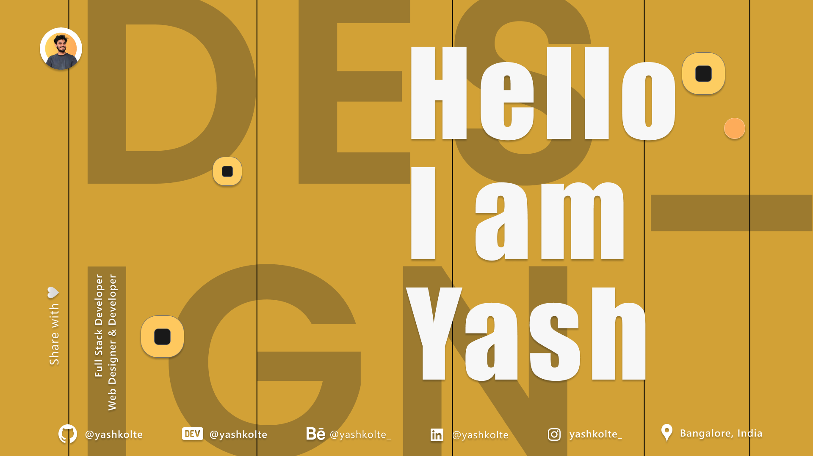

<picture>
 <source media="(prefers-color-scheme: dark)" srcset="./hero-dark.png">
 
</picture>

&nbsp;
 

I am Yash Kolte, a passionate self-learner and a Full Stack Developer who is obsessed with Web design and always looking to find patterns that are hidden in the Code World.

 

<h3>🛠 I Got you covered</h3>

<h4>Frontend Technology</h4>

&nbsp;
&nbsp;
&nbsp;
&nbsp;

<h4>MERN Stack Technology</h4>

&nbsp;
&nbsp;
&nbsp;
&nbsp;
&nbsp;

<h4>Backend Technology</h4>

&nbsp;
&nbsp;
&nbsp;
&nbsp;

<h4>Designing Tools</h4>

&nbsp;
&nbsp;

&nbsp;

 

<h2>Connect with me </h2>

   
 

 

<h2>📈 My Github Stats</h2>

  

  

 
 

<b>
Hey! Look at this snake eating up my contributions!
</b>

  

 

If you like my work, consider contributing to my repository. A cup of coffee is always appreciated, but your contribution is the most valuable reward.

 

 

Thank you for watching my profile. <i>Giving a star and following is free and unlimited.</i>

<h4 align="center">Share with Love 💚</h4> 

