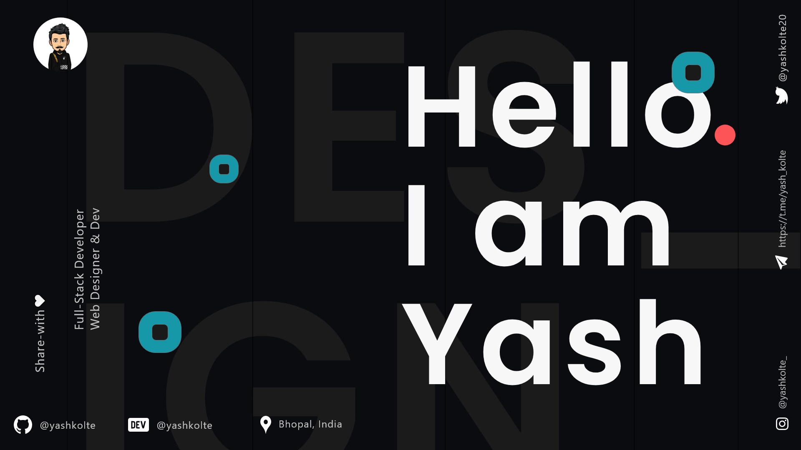
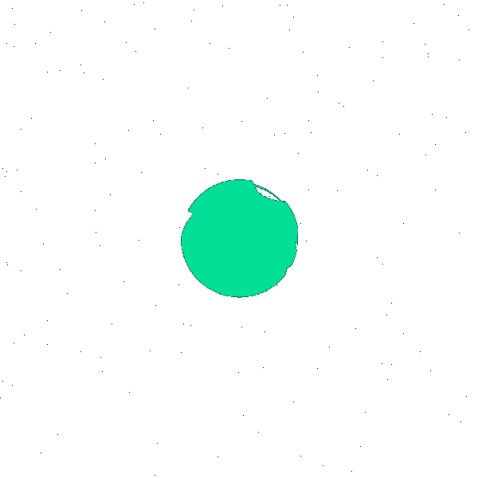

&nbsp;
 

### Hey Fokers 

𙄠ğ™–𙢠ğ™”ğ™–ğ™¨ğ™ ğ™ ğ™¤ğ™¡ğ™©ğ™š ğ™›ğ™§ğ™¤ğ™¢ ğ™„ğ™£ğ™™ğ™ğ™– 𝙖 ğ™ğ™ğ™ğ™§ğ™™ ğ™®ğ™šğ™–𙧠ğ™ªğ™£ğ™™ğ™šğ™§ğ™œğ™§ğ™–ğ™™ğ™ªğ™–ğ™©ğ™š ğ™¨ğ™©ğ™ªğ™™ğ™šğ™£ğ™©.
𝙖 𝙥𝙖𝙨𝙨𝙞𝙤𝙣𝙖𝙩𝙚 𝙨𝙚𝙡𝙛-𝙡𝙚𝙖𝙧𝙣𝙚𝙧 𝙖𝙣𝙙 𝙖 𝙁𝙪𝙡𝙡 𝙎𝙩𝙖𝙘𝙠 𝘿𝙚𝙫𝙚𝙡𝙤𝙥𝙚𝙧  ,
𝙬𝙝𝙤 𝙞𝙨 𝙤𝙗𝙨𝙚𝙨𝙨𝙚𝙙 𝙬𝙞𝙩𝙝 𝙒𝙚𝙗 𝘿𝙚𝙨𝙞𝙜𝙣𝙞𝙣𝙜 𝙖𝙣𝙙 𝙖𝙡𝙬𝙖𝙮𝙨 𝙡𝙤𝙤𝙠𝙞𝙣𝙜 𝙩𝙤 𝙛𝙞𝙣𝙙 𝙥𝙖𝙩𝙩𝙚𝙧𝙣𝙨 𝙤𝙛 𝙬𝙝𝙞𝙘𝙝 𝙖𝙧𝙚 𝙝𝙞𝙙𝙙𝙚𝙣 𝙞𝙣 𝙩𝙝𝙚 𝘾𝙤𝙙𝙚 𝙒𝙤𝙧𝙡𝙙.

 

  

### 🛠 &nbsp;Skills 

&nbsp;
&nbsp;
&nbsp;

\
 

&nbsp;
&nbsp;

&nbsp;
&nbsp;
&nbsp;

&nbsp;
&nbsp;

 

&nbsp;
 

&nbsp;

 

<h2> Connect with me  </h2>

   
 

 

<h2>📈 My Github Stats</h2>

  

   

<!--  -->

   

 
 
<b>
Hey! Look at this snake eating up my contributions!
</b>

  

  

 

If you like my work , Do contribute in my repository And buy me a coffee if you want its really appreciated.

 

 

Thank you for watching my profile , <i>Giving star and follow is free and Unlimited so don't hesitate.</i>

<h4 align="center">Share with Love 💚</h4> 

